# AgentSynth-Trinity 🛡️🏥💹

**AgentSynth-Trinity** is a next-generation research framework designed to overcome the **"dual-squeeze"** of data scarcity and stringent regulatory compliance (**GDPR/DPDP**) in the Healthcare and Finance sectors.

While traditional synthetic data often fails to maintain logical consistency or risks re-identification, this project introduces an **Agentic AI architecture** to generate data that is mathematically private yet highly functional for real-world AI training.

---

## 🏗️ Architecture

### System Design & Components

At its core, AgentSynth-Trinity operates as an intelligent coordination layer between generative models and privacy constraints. The system is composed of three specialized agents managed by a central orchestrator.

1.  **Orchestrator (LangGraph/NeMo)**: The "brain" of the operation that manages the state and handoffs between specialized agents.
2.  **Reasoning Generator (LLM)**: Unlike simple statistical generators, this agent uses Chain-of-Thought (CoT) logic to ensure data follows real-world semantic rules (e.g., patient vital signs must be clinically plausible).
3.  **Statistical Critic**: Acts as a feedback agent that evaluates multiple generative models (GANs, VAEs, Diffusion) to select the most statistically accurate candidate for the specific data modality.
4.  **Privacy Guard**: The final gatekeeper that implements **Differential Privacy (DP)** mechanisms, injecting controlled noise to ensure zero re-identification risk.

---

## 🌊 Data Flow Pipeline

The system follows a rigorous sequential process to transform raw, sensitive data into compliant synthetic assets:

1.  **Ingestion & Domain Analysis**: Raw data is ingested along with domain knowledge (medical guidelines or economic patterns).
2.  **Agentic Logic Drafting**: The Reasoning Generator creates a "logic skeleton" that preserves the semantic relationships between variables.
3.  **Synthesis Execution**: The Statistical Critic selects the optimal generator (e.g., TimeGAN for financial transactions) to populate the skeleton with high-fidelity values.
4.  **Privacy Sanitization**: The Privacy Guard applies DP-algorithms (using Opacus or SmartNoise-Synth) to the synthesized data.
5.  **Trinity Evaluation**: The data enters a multi-dimensional validation loop (Fidelity, Utility, Privacy).
6.  **Compliant Output**: Once all benchmarks are met, a verified dataset and its corresponding audit log are generated.

---

## 💎 The "Trinity" Evaluation Framework

The heart of the project is a multi-dimensional validation engine ensuring every dataset meets three critical benchmarks:

*   **Fidelity**: Measures statistical similarity to original data using **Wasserstein distance** and correlation preservation.
*   **Utility**: Empirical proof of performance when training downstream ML models (e.g., **XGBoost** or **Random Forest**).
*   **Privacy**: Mathematically provable and auditable guarantees using **Differential Privacy (DP)** and re-identification risk audits.

---

## 🎯 Key Use Cases

### 🏥 Healthcare
Simulating rare disease cohorts for clinical research and medical imaging (CT/MRI) without compromising patient confidentiality.

### 💹 Finance
Stress-testing fraud detection models and risk management systems using synthesized rare-event transaction data and time-series forecasting.

---

## 🛠️ Tech Stack

*   **Language**: Python
*   **Generative Models**: GANs (TimeGAN), VAEs, Diffusion Models
*   **Privacy**: SmartNoise-Synth, Opacus (Differential Privacy)
*   **Agents**: LangGraph / NVIDIA NeMo Agent Toolkit
*   **Evaluation**: SDV (Synthetic Data Vault), Scikit-learn
