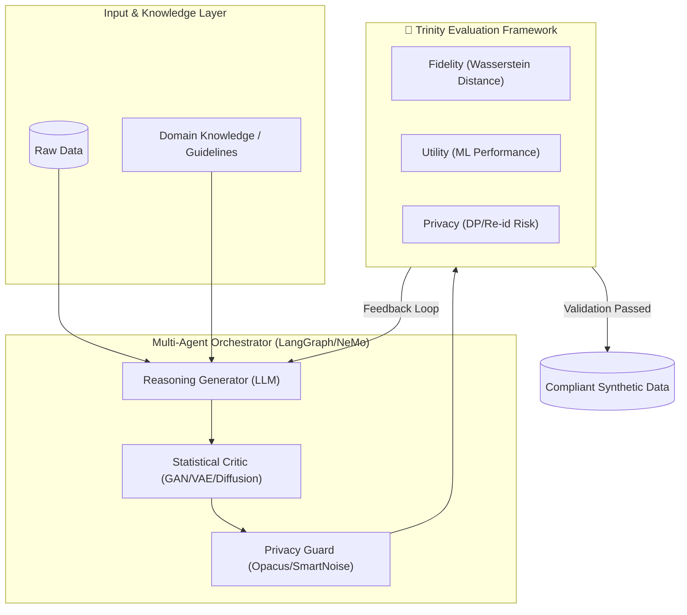
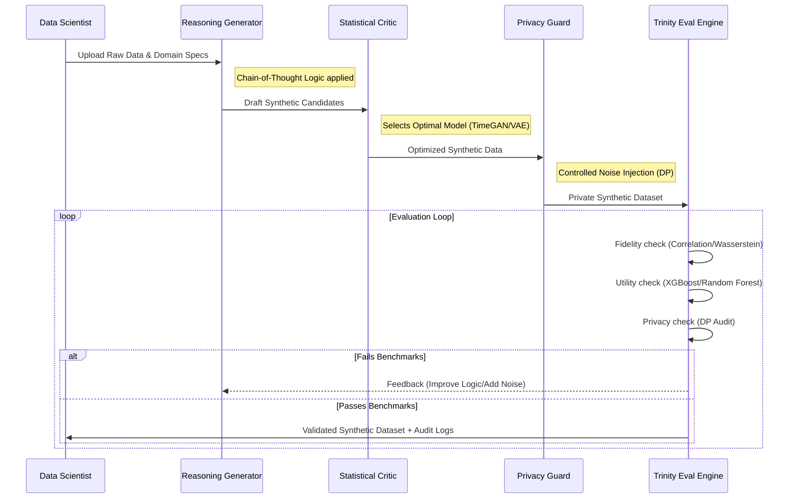

# AgentSynth-Trinity Architecture & Data Flow

This document provides the high-level architecture and data flow pipeline for the AgentSynth-Trinity research framework.

## 🛡️ System Architecture

The following diagram illustrates the multi-agent orchestrator and the "Trinity" evaluation framework.

---

## 💹 Data Flow Pipeline

Detailed flow of data from ingestion to compliant output.

